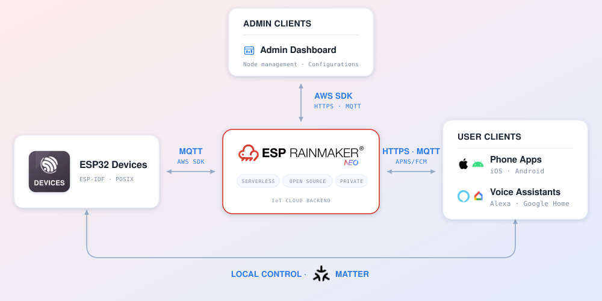

# ESP RainMaker Neo - Firmware SDK

[](https://github.com/espressif/esp-rainmaker-neo-firmware/actions/workflows/build.yml)
&nbsp;
[](https://github.com/espressif/esp-rainmaker-neo-firmware/actions/workflows/pre-commit.yml)
&nbsp;
[](LICENSE)

**Tools**

[](https://espressif.github.io/esp-launchpad/?flashConfigURL=https://espressif.github.io/esp-rainmaker-neo-firmware/launchpad.toml)
&nbsp;
[](https://apps.apple.com/us/app/esp-rainmaker-home/id1563728960)
&nbsp;
[](https://play.google.com/store/apps/details?id=com.espressif.novahome)

**Documentation**

[](https://neo.rainmaker.espressif.com)
&nbsp;
[](https://docs.neo.rainmaker.espressif.com/)
&nbsp;
[](https://docs.espressif.com/projects/esp-rainmaker-neo-firmware/en/latest/index.html)

---

## Introduction

ESP RainMaker Neo is a serverless, open-source IoT cloud for ESP devices that you deploy into your own AWS account. It scales with your fleet and is pay-as-you-go. Devices connect over MQTT through AWS IoT. Phone apps, the admin dashboard and voice assistants reach the same backend over REST APIs and MQTT.

<p align="center">
  
</p>

### Repositories

| Repository                                                                            | Holds                                            |
| ------------------------------------------------------------------------------------- | ------------------------------------------------ |
| [esp-rainmaker-neo-firmware](https://github.com/espressif/esp-rainmaker-neo-firmware) | (this repository) Device firmware SDK            |
| [esp-rainmaker-neo](https://github.com/espressif/esp-rainmaker-neo)                   | Cloud backend, admin dashboard                   |
| [esp-rainmaker-home](https://github.com/espressif/esp-rainmaker-home)<br>[esp-rainmaker-neo-app-sdk-ts](https://github.com/espressif/esp-rainmaker-neo-app-sdk-ts) | ESP RainMaker Home phone app (iOS and Android)<br>ESP RainMaker Neo App SDK (TypeScript) |


---

## Get Started

This is the SDK for building ESP RainMaker Neo firmware. It ships as a set of *ESP-IDF components*, with example scaffolding to build upon. The SDK also builds for POSIX hosts (as CMake libraries), currently intended for testing and development without hardware. The `rmng` codename is used to refer to the ESP RainMaker Neo project within the codebase.

Clone the repository:

```sh
git clone https://github.com/espressif/esp-rainmaker-neo-firmware.git
```

> [!NOTE]
> The minimum supported ESP-IDF version is **v6.0.2**.

**Quickstart:** Build an [example](examples/README.md), then follow the
[firmware guides](https://docs.neo.rainmaker.espressif.com/docs/firmware/)
for setup, configuration, device credentials, and network provisioning.

## Organization

```
cmake/                  // Repo build machinery (menuconfig, testing, file sync, ...)
third_party/            // Third-party sources, fetched at configure time and never committed
                        //    (see third_party/README.md for pins, licenses and overrides)
components/
├── osal/               // -> OS abstraction layer: one component, osal_* API,
│                       //    per-area ESP-IDF and POSIX implementations
├── esp_rmaker_neo/         // -> Main SDK component
├── esp_rmaker_neo_common/  // -> Shared utilities (MQTT glue, work queue, credentials, events, ...)
└── esp_rmaker_neo_ota/     // -> Optional OTA updates (AWS IoT Jobs + MQTT file streams)
docs/                   // Sphinx build: firmware specs + C API reference
examples/               // Examples, each also buildable on a POSIX host for testing
test/                   // Unit test apps and the PyTest integration suite
tools/                  // Python CLI tools (factory, OTA, local control) and their shared library
```

Each component and example directory carries its own `README.md` with the
next level of detail.

## Contributing

Contributions are welcome as pull requests on GitHub — see
[CONTRIBUTING.md](CONTRIBUTING.md) for the guidelines and the pre-commit
setup.

## Reporting Issues

Report bugs and feature requests through
[GitHub Issues](https://github.com/espressif/esp-rainmaker-neo-firmware/issues).
The issue templates ask for the details needed to diagnose build, runtime and
provisioning problems.

## License

The SDK is licensed under the [Apache License 2.0](LICENSE); example code is
released under CC0-1.0. Third party dependencies carry their own licenses.
