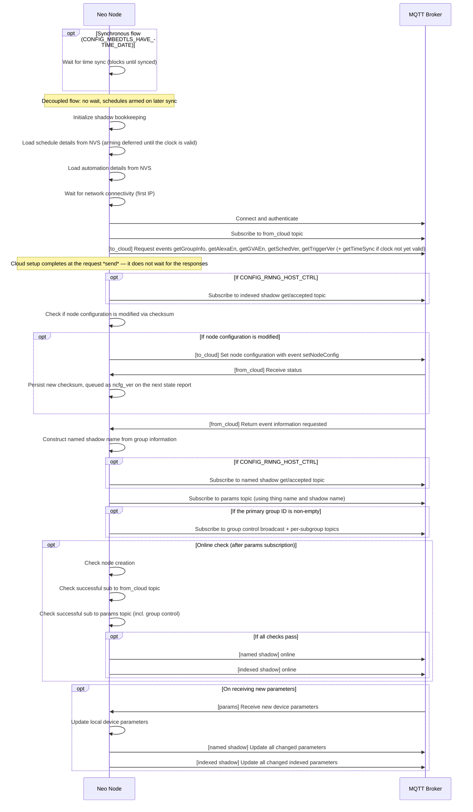

# Initialization and Startup Sequence

## Component Initialization Order

The node initialization follows a specific order with dependencies. Steps 1--4 are the *common components*, shared with the pre-provisioning path ([Network Provisioning](provisioning.md)); the rest run inside `esp_rmaker_node_init()`:

1.  **Connectivity trapdoor**: Arm the network-status trapdoor before the network can come up, so the start task can gate MQTT on connectivity
2.  **Event Loop**: Initialize event loop for inter-component communication
3.  **NVS (Non-Volatile Storage)**: Initialize NVS for persistent storage
4.  **Local Configuration**: Initialize local configuration management
5.  **Checksum**: Initialize the checksum store (node configuration and node tag change detection)
6.  **Time Synchronization**: Initialize SNTP, only if `enable_time_sync` is set in the configuration (see [Time Synchronization](time_sync.md))
7.  **Scheduler**: Initialize the timer/scheduler backend
8.  **Network Common**: Initialize network abstraction layer
9.  **State Change Management**: Initialize state change tracking and reporting
10. **Cloud Manager**: Initialize cloud event management
11. **Notification Manager**: Initialize notification publishing
12. **Timeseries Manager**: Initialize timeseries data collection
13. **Work Queue**: Initialize work queue for asynchronous tasks
14. **Bridge subsystem**: Only when `CONFIG_RMNG_BRIDGE_ENABLED` is set
15. **MQTT**: Select the MQTT implementation (wrapped by the budgeting shim when `CONFIG_ESP_RMAKER_MQTT_ENABLE_BUDGETING` is set), build the connection parameters from the credentials store, and initialize the client
16. **Services**: Initialize the schedule and automation services
17. **Start task**: Queue the start task as the first work-queue task, then post the "init done" event

Everything from the MQTT connection onwards happens in the start task, on the work queue — `esp_rmaker_node_init()` itself does not block on the network.

## Prerequisites

### Before Network Provisioning

- NVS must be initialized
- Event loop must be initialized
- Pre-provisioning SDK components must be initialized

### Before MQTT Connection

- Network provisioning must be complete
- Network connection must be established (the start task blocks on the connectivity trapdoor until the first IP is acquired; no-op on POSIX)
- Time synchronization must complete **in the synchronous flow only** (`CONFIG_MBEDTLS_HAVE_TIME_DATE`); the decoupled flow does not wait
- Shadow bookkeeping must be initialized
- Service data must be loaded from NVS (schedules, automation triggers)

### Before Cloud Communication

- MQTT connection must be established
- Cloud manager must be initialized
- Subscriptions to `from_cloud` topic must complete

On the first MQTT connection the SDK queues the cloud-setup task and (with `CONFIG_RMNG_HOST_CTRL`) the indexed-shadow subscribe task on the work queue, in that order. Because the work queue is serial, the indexed-shadow subscribe runs only after the whole cloud-setup task has finished, and the `setNodeConfig` drain — kicked from the end of cloud setup — is queued behind both. Cloud setup ends once the `get*` bundle has been *published*; it does not block on the responses, so the named-shadow and params subscriptions (driven by the `getGroupInfo` response) may land after `setNodeConfig`.

## Failure Points

### Initialization Failures

- **NVS Failure**: Prevents local configuration access; may require factory reset
- **Network Failure**: Prevents MQTT connection; node remains in provisioning or error state
- **Time Sync Failure**: In the synchronous flow (`CONFIG_MBEDTLS_HAVE_TIME_DATE`) startup blocks until sync (a valid clock is required for the TLS handshake); in the decoupled flow startup never blocks. See [Time Synchronization](time_sync.md)
- **MQTT Connection Failure**: Prevents cloud communication; triggers reconnection attempts
- **Shadow Initialization Failure**: Aborts the start task and leaves the SDK in the error state
- **Service Data Load Failure**: A failure to load schedule or automation details from NVS aborts the start task and leaves the SDK in the error state

### Startup Failure Handling

- **Init Failures**: Any failure inside `esp_rmaker_node_init()` tears down everything already initialized and returns an error — there is no partially initialized SDK
- **Start-Task Failures**: A failure in the start task leaves the SDK in the error state; nothing is torn down and no restart is triggered by the SDK
- **Non-Critical Failures**: Logged but do not prevent node operation (for example, a failed subscription is handed to a retry context)

## Relationship to Network Provisioning

- **Before Provisioning**: Pre-provisioning components are initialized
- **During Provisioning**: Network provisioning service runs
- **After Provisioning**: Pre-provisioning components are deinitialized, main node initialization begins

## Overall Firmware Flow

- Services have their own operation flows:
  - [Schedules](services/builtin.md#operation)
  - [Automation](services/builtin.md#operation-1)
