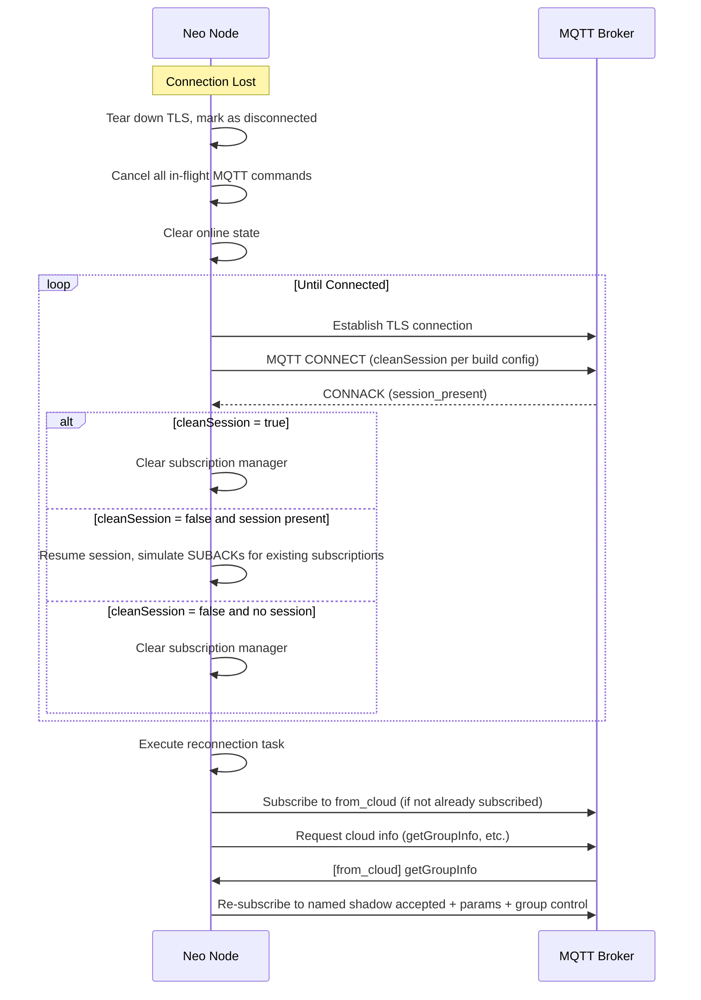

# MQTT Connection Management

This section describes MQTT connection behavior that applies to both ESP-IDF and POSIX platforms. The firmware uses a common MQTT interface that abstracts the underlying implementation:

- **ESP-IDF Platform**: Can use either `esp-mqtt` (ESP-IDF's MQTT client) or `coreMQTT` (FreeRTOS coreMQTT library) depending on configuration
- **POSIX Platform**: Uses `coreMQTT` exclusively

The behavior described below applies to both implementations through the common interface, though some implementation-specific details may differ.

## Connection and Authentication

The node connects to the MQTT broker using:

- **Client ID**: The thing name (node ID)
- **Authentication**: Mutual TLS (mTLS) using device certificates
- **Transport**: TLS over TCP
- **Broker Port**: `443` with the `x-amzn-mqtt-ca` ALPN protocol by default (`CONFIG_ESP_RMAKER_MQTT_PORT_443`), or `8883` without ALPN (`CONFIG_ESP_RMAKER_MQTT_PORT_8883`)
- **Clean Session**: A build-time setting, the same on every connection — `cleanSession = false` when `CONFIG_ESP_RMAKER_MQTT_USE_PERSISTENT_SESSION` is set, otherwise `cleanSession = true` (the default).
- **Last Will and Testament**: Not used. The node never publishes an offline message; `online = false` is set by the cloud (see [State Management](../state_management.md))
- **QoS**: node uses **QoS1** for all MQTT operations

## Reconnection Behavior

When the MQTT connection is lost, the node automatically attempts to reconnect:

- **Automatic Retry**: The node uses exponential backoff algorithm for reconnection attempts
- **Retry Forever**: Reconnection attempts continue indefinitely until successful
- **Backoff Parameters**: With coreMQTT, base delay `CONFIG_OSAL_MQTT_CORE_RETRY_BACKOFF_BASE_MS` (default 500 ms) up to `CONFIG_OSAL_MQTT_CORE_RETRY_MAX_BACKOFF_DELAY_MS` (default 5 000 ms)
- **TLS Reconnection**: The TLS connection is re-established before attempting MQTT connection
- **Forced Reconnect**: A change in the **primary** group ID forces a disconnect and reconnect (to pick up the refreshed AWS IoT policy). That one reconnect always uses `cleanSession = true`, regardless of the configured default; the setting reverts afterwards.

### Reconnection Flow



## Session Management

### Clean Session vs Persistent Session

- **Default (clean session)**: With `CONFIG_ESP_RMAKER_MQTT_USE_PERSISTENT_SESSION` unset, every connection uses `cleanSession = true`. The broker keeps nothing across reconnects, and the SDK drives its own re-subscription from the reconnection task.
- **Persistent session**: With the option set, every connection uses `cleanSession = false`, allowing the broker to maintain subscription state and QoS 1 message state across reconnections. Note that cached messages can then arrive at unexpected times.

### Session Restoration

- **Clean session**: The subscription manager is reset and every subscription must be re-established. `CONFIG_OSAL_MQTT_RESUBSCRIBE_ON_CLEAN_SESSION` (default off) would make the MQTT layer resubscribe automatically instead; it is recommended to leave it off, because the SDK already manages its own subscription state and would otherwise send redundant SUBSCRIBEs.
- **Persistent session, session present**: The node simulates SUBACK acknowledgments for all previously subscribed topics; no resubscription is required.
- **Persistent session, no session**: Treated like a clean session — the subscription manager is reset.

The topics re-established after a reset are:

- [from_cloud topic](mqtt_topics.md#from-cloud-subscribe)
- [Named shadow get/accepted topic](mqtt_topics.md#named-shadow-get-publish-and-get-accepted-subscribe) (only with `CONFIG_RMNG_HOST_CTRL`)
- [Parameters to Node topic](mqtt_topics.md#parameters-to-node-subscribe)
- [Group control topics](mqtt_topics.md#group-control-topics)
- [Indexed shadow get/accepted topic](mqtt_topics.md#indexed-shadow-get-publish-and-get-accepted-subscribe) (only with `CONFIG_RMNG_HOST_CTRL`)

## Keep-Alive and Connection Health

- **Keep-Alive Interval**: `CONFIG_OSAL_MQTT_KEEP_ALIVE_INTERVAL_S`, default 40 seconds, range 40 - 1200 seconds. The lower bound is 40 rather than the AWS IoT minimum of 30 to avoid spurious disconnects.
- **Ping Mechanism**: The node sends MQTT PINGREQ packets to maintain connection
- **Connection Monitoring**: Connection health is monitored through the MQTT command loop
- **Timeout Detection**: Keep-alive timeout triggers disconnection and reconnection

## Reconnection Task

After a successful reconnection, the node executes a reconnection task (`esp_rmaker_on_reconnect_task`) that re-runs the cloud-setup retry context. That context:

- Subscribes to the `from_cloud` topic if the node is not already subscribed
- Requests cloud information (group info, Alexa status, GVA status, schedule version, trigger version, and server time when the clock is not yet valid)
- Kicks the node-configuration drain, so a changed configuration is republished
- With `CONFIG_RMNG_HOST_CTRL`, also re-runs the indexed shadow subscribe context

The params and group control subscriptions are not re-issued directly by this task; they are re-established from the `getGroupInfo` response handler.

## MQTT Budgeting

MQTT budgeting is a rate limiting mechanism that controls the frequency of MQTT message publishing to prevent message flooding and respect cloud service limits. It is enabled by default (`CONFIG_ESP_RMAKER_MQTT_ENABLE_BUDGETING`), except in builds that do OTA over MQTT or that enable the bridge — both would exhaust the budget. When enabled, the budgeting shim wraps the platform MQTT implementation's publish function.

### How It Works

- **Budget Counter**: Each node maintains a budget counter that starts at a configured default value
- **Budget Consumption**: Each MQTT publish operation consumes one unit of budget
- **Budget Revival**: The budget is periodically increased by a configured amount at regular intervals
- **Maximum Budget**: The budget cannot exceed a configured maximum value
- **Message Dropping**: If the budget is exhausted, publish operations fail and messages are dropped

### Configuration Parameters

```{list-table}
:header-rows: 1
:widths: auto

* - Option
  - Meaning
  - Default (range)

* - ``CONFIG_ESP_RMAKER_MQTT_DEFAULT_BUDGET``
  - Initial budget value when budgeting is enabled
  - 100 (64 -- max budget)

* - ``CONFIG_ESP_RMAKER_MQTT_MAX_BUDGET``
  - Upper limit for the budget counter
  - 1024 (64 -- 2048)

* - ``CONFIG_ESP_RMAKER_MQTT_BUDGET_REVIVE_PERIOD``
  - Seconds between budget revivals
  - 5 (5 -- 600)

* - ``CONFIG_ESP_RMAKER_MQTT_BUDGET_REVIVE_COUNT``
  - Amount added to the budget on each revival
  - 1 (1 -- 16)
```

### Impact on Operations

When budgeting is enabled:

- Shadow updates may be dropped if budget is exhausted (which schedules a full-state retry, see [Error Handling and Recovery Strategies](../error_handling.md))
- Timeseries data may be dropped if budget is exhausted
- Event publishing may be dropped if budget is exhausted
- Subscription operations are not affected by budgeting
- OTA over MQTT does not participate in budgeting

### Budget Revival

The budget revival mechanism runs as a periodic task:

- Adds the configured revive count to the current budget
- Caps the budget at the maximum budget value
- Continues indefinitely while the node is running
