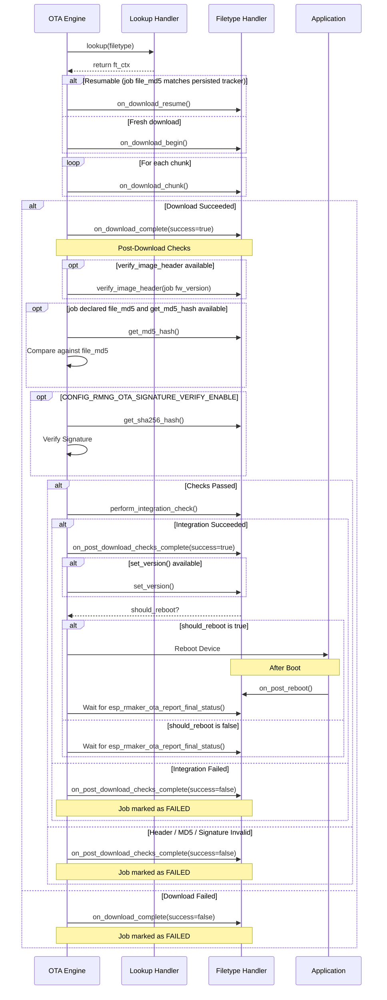

# Custom OTA Filetypes

The ESP RainMaker Neo OTA SDK supports custom filetypes beyond the default firmware update. This allows you to update other components of your system, such as a co-processor firmware.

## Implementation Overview

To implement a custom OTA filetype, you need to:

1.  **Define a Filetype Handler**: Implement the `esp_rmaker_ota_ft_ctx_t` structure with the necessary callback functions.
2.  **Provide a Lookup Handler**: Implement a function that returns the appropriate handler context based on the `filetype` string.
3.  **Enable OTA with the Lookup Handler**: Pass your lookup handler to the OTA configuration when calling `esp_rmaker_ota_enable()`.
4.  **Use the ``filetype`` field in the OTA Job**: Ensure your OTA job document includes the `filetype` field under the `rmng_ota` key.

## 1. Defining a Filetype Handler

The filetype handler is a structure of type `esp_rmaker_ota_ft_ctx_t` (defined in `esp_rmaker_ota_filetype_handler.h`). It contains various callbacks that the OTA engine invokes during different stages of the OTA process.

### Required Handlers

The following handlers **must** be implemented, or the handler is rejected as invalid at job-parse time:

- `on_download_begin`: Called when the download starts. You should allocate any necessary resources (e.g., a download context) and return a handle.
- `on_download_chunk`: Called for each chunk of data received.
- `on_download_complete`: Called when the download is finished (successfully or otherwise). You should perform initial cleanup here.
- `get_sha256_hash`: Returns the SHA256 hash of the downloaded data for signature verification. Required even when `CONFIG_RMNG_OTA_SIGNATURE_VERIFY_ENABLE` is off (in which case the engine never calls it).
- `perform_integration_check`: Performs any final checks before the update is considered valid (e.g., checksum verification, internal version checks).
- `on_post_download_checks_complete`: Called after the header, MD5, signature and integration checks. You must decide if the device should reboot.

### Optional Handlers

- `get_version` & `version_to_uint32`: **(Pairwise Optional)** If you want the engine to perform automatic version checks (preventing downgrades), you must implement both. Implementing exactly one makes the handler invalid and the job is rejected with `"Filetype handler is invalid"`.
- `set_version`: Called to persist the version after a successful post-download check.
- `on_post_reboot`: Called after the device reboots following an update. Use this to perform post-update initialization or asynchronous status reporting. **Mandatory in practice if you ever signal a reboot** — after the reboot, a handler that requested one without this callback has its job reported **FAILED** with `"Custom filetype handler does not have a post reboot handler even though it was instructed to reboot post-download"`, since the job would otherwise stay `IN_PROGRESS` forever.
- `on_download_resume`: **(Auto-resume)** Called instead of `on_download_begin` when the engine has a valid persisted progress tracker for the same target image (matched via the job's `file_md5`). Reopen your destination **without** discarding already-written data, ready for further `on_download_chunk` writes. If you return an error, the engine falls back to a fresh `on_download_begin` (full re-download); if you leave this `NULL`, your filetype never resumes.
- `get_md5_hash`: **(Auto-resume integrity)** Returns the MD5 (16 bytes) of the processed data. When the job declares `file_md5`, the engine calls this after download and fails the job on mismatch. If `NULL`, the MD5 check is skipped (with a warning) even when `file_md5` is present.
- `verify_image_header`: Called after `on_download_complete` and before the MD5 and signature checks, with the job-declared `fw_version` (which may be `NULL`). Use it to confirm the downloaded payload's own embedded header matches what the job claimed. If `NULL`, the check is skipped entirely — see [Image Header Verification](job_document.md#esp-rainmaker-neo-ota-fields) in the job document reference for why that is discouraged.

> **Resume tracker ownership.** The engine auto-manages the resume tracker only for the **default firmware** handler (the MQTT block bitmap, stored in the `ota` NVS namespace). Custom handlers that want to resume must persist their own progress under their **own NVS key** and reopen accordingly in `on_download_resume`.

For a reference implementation, see [`ota_filetype_handler_internal.c`](https://github.com/espressif/esp-rainmaker-neo-firmware/blob/main/components/esp_rmaker_neo_ota/src/ota_filetype_handler_internal.c), which implements the default firmware update.

## 2. Providing a Lookup Handler

The lookup handler matches the `filetype` string from the OTA job document to your custom handler context. Here is an example implementation:

```c
const esp_rmaker_ota_ft_ctx_t *my_custom_ft_lookup(const char *filetype, size_t filetype_len)
{
    if (strncmp(filetype, "my_config", filetype_len) == 0) {
        return &my_config_handler_ctx;
    } else if (strncmp(filetype, "co_processor", filetype_len) == 0) {
        return &co_processor_handler_ctx;
    }
    return NULL;
}
```

## 3. Enabling OTA

Pass the lookup handler in the `esp_rmaker_ota_config_t` structure.

```c
esp_rmaker_ota_config_t ota_config = {
    .custom_filetype_handler_lookup = my_custom_ft_lookup,
};
esp_rmaker_ota_enable(&ota_config);
```

## 4. OTA Job Document

The OTA job document must include the `filetype` field. If the field is missing or empty, the engine defaults to the internal firmware update handler. Refer to [Job Document - ESP RainMaker Neo OTA fields](job_document.md#esp-rainmaker-neo-ota-fields).

## OTA Process Flow

The following diagram shows how the OTA engine interacts with your custom handlers.



## Reporting Final Status

For custom filetypes, the OTA engine often cannot determine the final success of an update automatically (especially if no reboot is required or if the update involves an asynchronous process).

You **must** call `esp_rmaker_ota_report_final_status()` to mark the job as `SUCCEEDED` or `FAILED`.

### Important Considerations:

- **Status Timer**: A 10-second timer is armed just before `on_post_download_checks_complete` is called with `success=true`, and just before `on_post_reboot` is called. If `esp_rmaker_ota_report_final_status()` is not called within this window, the job is automatically marked as **FAILED** with reason `"Timed out waiting for final status"`. The timer is not armed when the post-download checks already failed, and is disarmed if your handler returns an error or requests a reboot (in which case `on_post_reboot` re-arms it after boot).
- **Asynchronous Operations**: If your update triggers an asynchronous task (e.g., flashing a co-processor in the background), you must ensure that task reports the final status once finished.
- **Out-of-Sequence Reporting**: You can call `esp_rmaker_ota_report_final_status()` at any time if a terminal failure occurs during your handler execution, even before the engine expects a final status. However, the engine typically expects it after the post-download or post-reboot stages.
