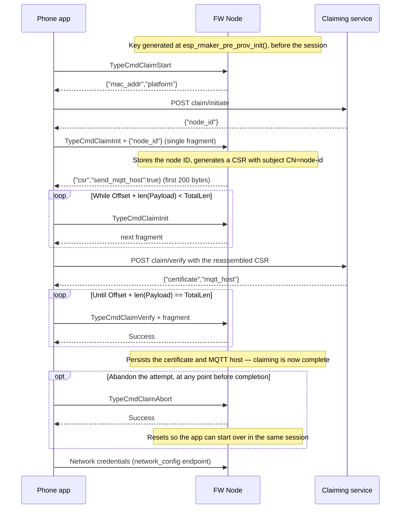

# Network Provisioning

Network provisioning is the process by which a node obtains network credentials to connect to a local network. The specific transport methods and provisioning protocols are platform-specific and not part of the ESP RainMaker Neo firmware specification.

## Provisioning Sequence

From the ESP RainMaker Neo firmware perspective, the provisioning sequence follows these steps:

1.  **Pre-Provisioning Initialization**: SDK components required for provisioning are initialized (`esp_rmaker_pre_prov_init()`)
2.  **Network Start**: The provisioning service is started and awaits provisioning completion
3.  **Post-Provisioning Cleanup**: SDK components used only for provisioning are deinitialized (`esp_rmaker_pre_prov_deinit()`)
4.  **Node Initialization**: The main node initialization proceeds after provisioning is complete

## Challenge-Response Endpoint

During network provisioning, the node exposes a `ch_resp` protocomm endpoint for user-node association:

- **Purpose**: Handles challenge-response authentication for associating users with nodes

- **Protocol**: Uses protobuf messages (see [ch_resp usage](#ch_resp-usage))

- **Security**: Uses device private key to sign challenges

- **Availability**: The same `ch_resp` endpoint handler is reachable through three mutually exclusive transports, selected at build time:

  - the **provisioning** protocomm endpoint, during network provisioning;
  - the **local endpoints** HTTP service with the full local-control endpoint set, when `CONFIG_ESP_RMAKER_LOCAL_CTRL_CHAL_RESP_ENABLE` is set (see [Local Control](services/optional.md#local-control));
  - the same **local endpoints** HTTP service with only the `ch_resp` endpoint, when `CONFIG_ESP_RMAKER_ON_NETWORK_CHAL_RESP_ENABLE` is set — for nodes that are already on the network and never run provisioning.

  The last two are the same protocomm HTTP instance — the two options only decide which endpoint set the application enables, and they are mutually exclusive at the Kconfig level. Neither may run while provisioning is active.

- **Disabling**: The endpoint can be disabled at runtime (for example once association has succeeded), and the disable **persists across reboots** — it is stored in NVS and cleared only by a factory reset. A disabled endpoint answers with status `Disabled`.

## Claim Endpoint

When assisted claiming is enabled (`CONFIG_ESP_RMAKER_ASSISTED_CLAIM`) and the node has no
certificate yet, the node also exposes a `rmaker_claim` protocomm endpoint:

- **Purpose**: Lets a node without pre-flashed cloud credentials obtain them at first setup.
  The node generates a private key and a Certificate Signing Request; the phone app relays
  them to the ESP RainMaker claiming service and returns a certificate and a cloud-assigned
  node ID.
- **Availability**: Only during network provisioning, and only while the node is unclaimed.
  Once claimed, the endpoint is not created at all.
- **Protocol**: Protobuf frames carrying JSON payloads (see [rmaker_claim usage](#rmaker_claim-usage))
- **Advertised as**: app-info label `rmaker`, version `1.0`, capability `claim`
- **Direction**: The device is a pure responder; the phone app drives the exchange.

### `rmaker_claim` usage

The exchange is defined in protobuf. Every request is a `RMakerClaimPayload` with a
`cmdPayload`; every response is a `RMakerClaimPayload` whose `msg` is the request's
`msg` **+ 1** and whose `respPayload` carries a `status` and a `buf`.

Payloads larger than **200 bytes** are fragmented. `PayloadBuf` carries `Offset`, `Payload`
and `TotalLen`; a receiver reassembles until `Offset + len(Payload) == TotalLen`.



The app completes claiming **before** it sends network credentials. That ordering is what gives
the exchange the whole provisioning session to finish: the node stops waiting when the session
ends, and the credentials are in place before `esp_rmaker_node_init()` reads them.

| Step | Request → Response | Payload |
|---|---|---|
| 1 | `TypeCmdClaimStart` → `TypeRespClaimStart` | Response is the claim-init request, unfragmented: `{"mac_addr":"AABBCC112233","platform":"<idf-target>"}`. The app POSTs it to `claim/initiate`. |
| 2 | `TypeCmdClaimInit` → `TypeRespClaimInit` | First request carries the service's `{"node_id":"<node-id>"}`, which **must** arrive in a single fragment. The node stores the node ID, generates a CSR with subject `CN=<node-id>`, and answers with fragments of `{"csr":"<PEM, newlines escaped as \n>","send_mqtt_host":true}`. Repeat until all fragments are received; the app POSTs the reassembled JSON to `claim/verify`. |
| 3 | `TypeCmdClaimVerify` → `TypeRespClaimVerify` | Request carries fragments of the service's `{"certificate":"<PEM, newlines escaped>","mqtt_host":"..."}`. Both fields are required. On the final fragment the node parses both, then persists the credentials; a response missing either field yields `InvalidParam`, writes nothing, and fails that attempt — the app may restart from step 1 while the session lasts. |
| 4 | `TypeCmdClaimAbort` → `TypeRespClaimAbort` | Cancels claiming. The node resets its state so claiming can be retried within the same provisioning session. |

`status` is one of `Success`, `Fail`, `InvalidParam`, `InvalidState` or `NoMemory`. A request
arriving out of order yields `InvalidState`; an oversized fragment yields `NoMemory`.

A fragmented response must open at offset 0, continue exactly where the previous fragment
ended, and repeat the same `totallen` throughout — the opening fragment pins it. Gaps, overlaps,
retransmits and a total that changes mid-response are each rejected with `InvalidParam`.

Claiming may be restarted from step 1, or abandoned with step 4, at any point **before** the
certificate is persisted. Once it is, the exchange is complete and every further command —
including `TypeCmdClaimStart` and `TypeCmdClaimAbort` — yields `InvalidState`. A completed
claim cannot be restarted, overwritten or cancelled within the same session; clearing
credentials is a local operation.

On success the node stores `node_id`, `client_cert`, `client_key` and `mqtt_host` in the
factory partition — the same keys the host-side factory tooling writes, so the rest of the SDK
reads credentials unchanged.

The verify response may also carry `mqtt_cred_host`, the AWS IoT credentials-provider
endpoint. If present it is ignored and not persisted.

For configuration and operational detail, see the [claiming guide](https://docs.neo.rainmaker.espressif.com/docs/firmware/device-credentials/claiming).

## User-Node Association

When user-node association is to be performed:

1.  The node will receive a **challenge** consisting of *64 random alphanumeric characters*.
2.  The node will generate a **digital signature** for this challenge with its *private key*.
3.  This digital signature is sent back to the *user*.

This is achieved through a [protocomm endpoint](https://docs.espressif.com/projects/esp-idf/en/stable/esp32/api-reference/provisioning/protocomm.html) named `ch_resp`.

### `ch_resp` usage

Every request and response is an `RMakerChRespPayload` whose `msg` field selects the operation and whose `payload` oneof carries the operation-specific body. `status` is one of `Success`, `Fail`, `InvalidParam` or `Disabled`.

#### Sending a Challenge

Send in this format to the endpoint:

```protobuf
RMakerChRespPayload {
    msg: RMakerChRespMsgType = TypeCmdChallengeResponse,
    cmdChallengeResponsePayload: CmdCRPayload = {
        payload = <challenge to sign>
    }
}
```

#### Getting a Response

The endpoint returns the following:

```protobuf
RMakerChRespPayload {
    msg: RMakerChRespMsgType = TypeRespChallengeResponse,
    status: RMakerChRespStatus = <Success/Fail/InvalidParam/Disabled>,
    respChallengeResponsePayload: RespCRPayload = {
        payload = <signature for challenge>,
        node_id = <node ID>
    }
}
```

#### Other operations

The same endpoint also serves:

```{list-table}
:header-rows: 1
:widths: auto

* - Command
  - Response
  - Purpose

* - ``TypeCmdGetNodeID`` with ``cmdGetNodeIDPayload`` (empty)
  - ``TypeRespGetNodeID`` with ``respGetNodeIDPayload { node_id }``
  - Read the node ID without signing a challenge

* - ``TypeCmdDisableChalResp`` with ``cmdDisableChalRespPayload`` (empty)
  - ``TypeRespDisableChalResp`` with ``respDisableChalRespPayload`` (empty);
    result is in ``status``
  - Disable challenge-response; persists across reboots until factory reset
```

Once disabled, a `TypeCmdChallengeResponse` is answered with `TypeRespChallengeResponse` and status `Disabled`.
