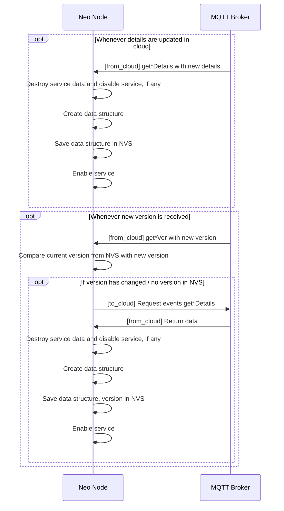
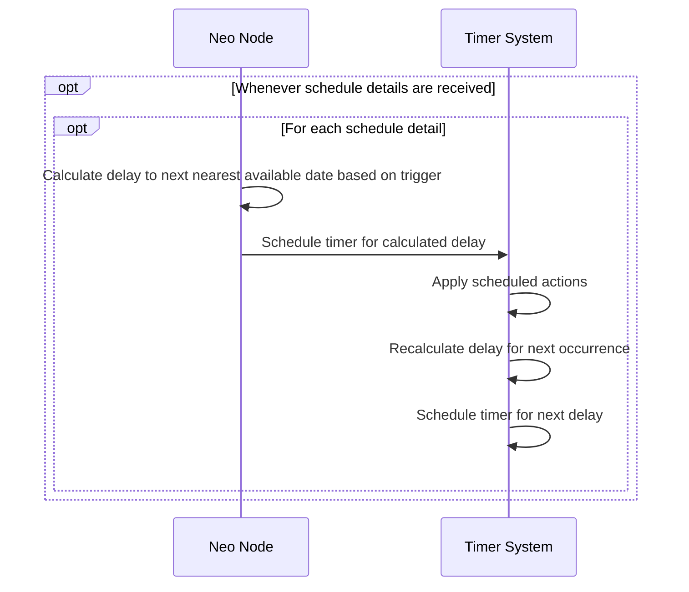
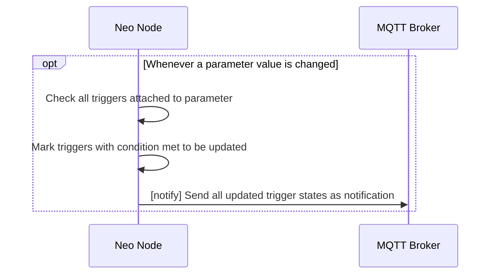

# Built-in Services

Current services include:

- [Schedules](#schedules)
- [Automation](#automation-triggers)

## Details Maintenance

Each service has their corresponding [cloud 'get' events](../networking/cloud_communication.md#get-events) for:

- `get*Ver`: get current details version in cloud
- `get*Details`: get current details from cloud



## Schedules

Schedule details are received as a **JSON array of objects**, with each object representing its own schedule.

### Operation



### 'get' Events

Used in [details maintenance](#details-maintenance):

- **Schedule version**: `getSchedVer`
- **Schedule details**: `getSchedDetails`

### Payload

#### Payload model

- **Schedule data is the entire expected state of all schedules on the node.** There are no `add`/`remove`/`edit`/`enable`/`disable` operations — a payload replaces the set, and re-sending it is always safe.
- **`id` is the unique identifier.** The `name` field, if present, is display-only and ignored by the node; because a payload carries the whole state, no name lookup is needed.
- **Each schedule has exactly one trigger.** The `triggers` array is accepted, but only **index 0** is applied; further entries are **dropped** (the node logs a warning). To express what would have been several triggers, send **several schedules**, each with its own `id`.
- **Schedules are removed once they can no longer fire** — see [Schedule lifetime](#schedule-lifetime).

The NVS key for a schedule is *not* the `id` value: it is the lowercase hex of the first 7 bytes of `SHA-256("<owner_id>" ":" "<id>")`, i.e. 14 characters, which keeps the key inside the platform's NVS key length limit. `<owner_id>` is empty for the device's own schedules and the bridged child's local id otherwise, so a child cannot collide with the device on the same `id`.

Migrating from classic ESP RainMaker scheduling: the four points above are the behavioural differences to account for.

#### Limits and rejection behaviour

- At most `CONFIG_RMAKER_SCHEDULING_MAX_SCHEDULES` schedules are installed per node (default 10, range 1--50). Entries beyond that are **truncated with a warning**, not rejected as a set.
- A schedule with `"enabled": false` is skipped entirely — it is not installed and no timer is armed for it.
- An unparsable schedule (missing/oversized `id`, bad trigger, bad validity, bad action) is skipped individually; the remaining schedules from the same payload are still installed.
- Schedule *arming* requires a valid wall clock. Details are loaded and installed regardless; arming is deferred until the clock becomes valid (see [Time Synchronization](../time_sync.md)).

#### Upload Format

To ensure the node receives the schedules correctly:

- `PUT` to `{ApiGatewayUrl}/group/{group_id}/node/{node_id}/schedule`
- `{group_id}`: **primary** group ID of the node
- `{node_id}`: node's ID / thing name

##### Body

```javascript
{
    "schedule": {
        "Schedules": [
            <schedule_object>,
            // ... more schedule objects as needed
        ]
    }
}
```

- `<schedule_object>`: See [schedule object](#schedule-object).

#### Schedule Object

```text
{
    // unique ID of the schedule (mandatory)
    "id": <schedule id>,

    // whether this schedule is enabled/disabled
    "enabled": true/false,

    // this schedule's trigger. Only index 0 is applied; further
    // entries are accepted but dropped.
    "triggers": [
        <trigger object>
    ],

    // action to take when triggered
    "action": <update payload>,

    // (optional) validity period of this schedule
    "validity": {
        "start": <UNIX timestamp>,
        "end": <UNIX timestamp>
    }
}
```

These are the **minimally required keys**:

- Additional keys are *ignored* and not processed (e.g., `name` — kept by the cloud for display but **not used by the node**).
- `<schedule id>`: **mandatory**, and must be **less than or equal to 16 characters**. This limit is enforced on the device at parse time — schedules with a missing, empty, non-string, or oversized `id` are rejected by the node. The `id` is *not* used directly as the NVS key; instead the NVS key is a fixed-length string derived by hashing the `id` (SHA-256, truncated).
- `<trigger object>`: see [Triggers](#triggers).
- `<update payload>`: see [Payload Specifications](../state_management.md#incoming-state-modifications).

##### Triggers

A schedule carries **one** trigger. The `triggers` array may contain more, but only **index 0** is applied and the rest are dropped with a warning — send additional schedules instead.

If index 0 is unusable (unrecognised, or missing a field its shape requires) the whole **schedule is rejected**; a valid entry later in the array does *not* rescue it.

Each trigger object can be one of the following. The trigger *kind* is inferred from which keys are present, in this order of precedence:

1.  `rsec` present → one-shot relative trigger; no other key is considered.
2.  `dd` present → date trigger. It overrides `d`, which is dropped with a warning. `mm` and `yy` are read only alongside `dd`; on their own they are ignored with a warning.
3.  Otherwise `d` present → day-of-week trigger.
4.  `lat` **and** `lon` present, plus one of `sr`/`ss` → solar trigger; whichever single day arm was parsed above is retained as a constraint.

A trigger whose keys match none of the above is unusable, and so is a day-of-week or date trigger that omits `m` or gives one outside 0--1439.

###### One-shot, relative

```text
{
    "rsec": <number of seconds after current time>,

    // optional: absolute UTC seconds for the next firing, used to survive reboots
    "ts": <UNIX timestamp>
}
```

`rsec` must be **greater than 0**. Fires exactly once.

The node resolves `rsec` to an absolute instant when the schedule is armed and persists it as `ts`, so a reboot does not restart the countdown. Once it has fired the schedule is removed (see [Schedule lifetime](#schedule-lifetime)).

###### Date-based

```text
{
    // "m" is required
    "m": <minutes since midnight>,

    // exactly one of "d" or "dd" is required -- they are mutually exclusive
    "d": <bit mask of days of week, Bits 7 to 1 (LSB) as Sunday/Saturday/.../Tuesday/Monday>,
    "dd": <day of the month>,

    // "mm" and "yy" apply to "dd" only, and are both optional
    "mm": <bit mask of months in a year, Bits 12 to 1 (LSB) as Dec/Nov/.../Feb/Jan>,
    "yy": <specific calendar year; 0 or absent means every year>
}
```

A date-based trigger selects days by **one** of two arms:

- the **weekday arm** — `d` alone. Any weekday bit set makes the schedule repeat on those days indefinitely; `"d": 0` selects no weekday and instead means **fire once**, at the next occurrence of `m`.
- the **date arm** — `dd`, optionally narrowed by `mm` and `yy`.

The two are **mutually exclusive**. If both `d` and `dd` are present the node keeps the **date arm** and drops `d` (logging a warning); the two are never combined, and there is no way to express "these weekdays *or* the Nth". `mm` and `yy` are meaningful only alongside `dd` — without it they are ignored.

`m` must be in **0..1439**; anything outside that range causes the trigger, and therefore the schedule, to be rejected.

**How `mm` and `yy` shape recurrence** (date arm only):

| `dd` | `mm` | `yy` | Behaviour |
|------|------|------|-----------|
| set  | absent | absent | That day of **every month, every year**. |
| set  | absent | set    | That day of every month, **in that year only**. |
| set  | mask   | absent | That day of the masked months, **every year**. |
| set  | mask   | set    | That day of the masked months, **in that year only**. |
| set  | `0`    | any    | **Fires once**, on the next matching day (bounded by `yy` if given). |
| absent | any  | any    | `mm`/`yy` ignored — `d` is then required. |

So an omitted `mm` means *every month*, and an omitted `yy` means *every year*. An explicit `"mm": 0` is what makes a dated schedule one-shot. A `yy` in the past means the schedule can never fire, and it is dropped (see [Schedule lifetime](#schedule-lifetime)).

Examples:

```text
// 5:00 A.M. every Monday, Wednesday -- weekday arm
{
    "m": 300, // 300 = 5 * 60 + 0  --> 05:00
    "d": 5    //   5 = 0b000_0101  --> Wed/Mon
}

// 7:30 P.M. on the 20th of every month, every year -- date arm
{
    "m": 1170, // 1170 = 19 * 60 + 30 --> 19:30
    "dd": 20   // no "mm"/"yy" --> every month, every year
}

// 2:03 P.M. on the 14th of (Jan to Apr), every year
{
    "m": 843,  // 843 = 14 * 60 + 03      --> 14:03
    "dd": 14,
    "mm": 15   //  15 = 0b0000_0000_1111  --> Apr/Mar/Feb/Jan
}

// 2:03 P.M. every Tuesday to Saturday -- must be a SEPARATE schedule:
// the weekday and date arms cannot be combined into one trigger.
{
    "m": 843,
    "d": 62    //  62 = 0b011_1110        --> Sat/Fri/Thurs/Wed/Tues
}

// 9:47 A.M. on the 20th of (Feb, Nov), in 2027 only
{
    "m": 587,   //  587 = 09 * 60 + 47      --> 09:47
    "dd": 20,
    "mm": 1026, // 1026 = 0b0100_0000_0010  --> Nov/Feb
    "yy": 2027  // that year only; afterwards the schedule is removed
}

// (one-shot) 12:00 A.M. on the next 9th, in 2035 only
{
    "m": 0,     //   0 = 00 * 60 + 00      --> 00:00
    "dd": 9,
    "mm": 0,    // explicit 0 --> fires once
    "yy": 2035
}
```

###### Solar (sunrise/sunset)

Solar triggers calculate timing based on astronomical sunrise/sunset times and can be combined with date-based constraints to trigger only on specific days of the week, dates, or months.

```text
{
    // "lat" and "lon" are required
    "lat": <latitude in decimal degrees>,
    "lon": <longitude in decimal degrees>,

    // exactly one of "sr" or "ss" is required; if both are given, "sr" wins
    "sr": <offset in minutes from sunrise (positive = after sunrise, negative = before sunrise)>,
    "ss": <offset in minutes from sunset (positive = after sunset, negative = before sunset)>,

    // optional day selection -- at most ONE arm, exactly as for date-based
    // triggers: either "d", or "dd" (+ optional "mm"/"yy"). Never both.
    "d": <bit mask of days of week, Bits 7 to 1 (LSB) as Sunday/Saturday/.../Tuesday/Monday>,

    "dd": <day of the month>,
    "mm": <bit mask of months in a year, Bits 12 to 1 (LSB) as Dec/Nov/.../Feb/Jan>,
    "yy": <specific calendar year>
}
```

Solar triggers calculate the sunrise/sunset time from the device's location, then select days using the **same two mutually exclusive arms** as [date-based triggers](#date-based) — the weekday arm (`d`) or the date arm (`dd`/`mm`/`yy`), never a combination. `m` is not used; the solar event supplies the time of day.

If **no** day constraint is given, the trigger fires on **every** valid day within the schedule's [validity period](#schedule-object).

Field descriptions:

- **"lat"**: Latitude in decimal degrees
  - Positive values: North of the equator (e.g., 40.7128 for New York City)
  - Negative values: South of the equator (e.g., -33.8688 for Sydney)
- **"lon"**: Longitude in decimal degrees
  - Positive values: East of the Prime Meridian (e.g., 139.6503 for Tokyo)
  - Negative values: West of the Prime Meridian (e.g., -74.0060 for New York City)
- **"sr"**: Sunrise trigger with offset in minutes from sunrise
- **"ss"**: Sunset trigger with offset in minutes from sunset
- **"d"**: Same bit mask format as date-based triggers. Mutually exclusive with `dd`/`mm`/`yy`.
- **"dd"**: Same format as date-based triggers (1-31). Mutually exclusive with `d`.
- **"mm"**: Same bit mask format and recurrence meaning as date-based triggers (applies to `dd` only)
- **"yy"**: Same format and recurrence meaning as date-based triggers (applies to `dd` only)

**Note**: Solar triggers require the `CONFIG_ESP_SCHEDULE_ENABLE_DAYLIGHT` configuration option to be enabled. Without it, `lat`/`lon`/`sr`/`ss` are not parsed at all, so a solar-only trigger is skipped as invalid.

**Note**: A solar trigger does **not** use `m`; the time of day comes from the computed sunrise/sunset plus the offset.

Examples:

**Basic solar triggers (daily):**

```json
// Trigger exactly at sunrise in New York City
// Location: New York City, USA (40.7128°N, 74.0060°W)
{
    "lat": 40.7128,
    "lon": -74.0060,
    "sr": 0
}

// Trigger 30 minutes before sunset in London
// Location: London, UK (51.5074°N, 0.1278°W)
{
    "lat": 51.5074,
    "lon": -0.1278,
    "ss": -30
}
```

**Solar triggers with day-of-week constraints:**

```json
// Sunrise trigger only on weekdays (Monday to Friday)
// Location: New York City, USA (40.7128°N, 74.0060°W)
{
    "lat": 40.7128,
    "lon": -74.0060,
    "sr": 0,
    "d": 31  // 31 = 0b0011111 = Mon/Tue/Wed/Thu/Fri
}

// Sunset trigger only on weekends (Saturday and Sunday)
// Location: London, UK (51.5074°N, 0.1278°W)
{
    "lat": 51.5074,
    "lon": -0.1278,
    "ss": 0,
    "d": 96  // 96 = 0b1100000 = Sun/Sat
}
```

**Solar triggers with specific date constraints:**

```json
// Sunrise trigger on the 15th of every month
// Location: Tokyo, Japan (35.6762°N, 139.6503°E)
{
    "lat": 35.6762,
    "lon": 139.6503,
    "sr": 0,
    "dd": 15
}

// Sunset trigger only in summer months (Jun, Jul, Aug)
// Location: Sydney, Australia (33.8688°S, 151.2093°E)
{
    "lat": -33.8688,
    "lon": 151.2093,
    "ss": 0,
    "mm": 7   // 7 = 0b000000000111 = Aug/Jul/Jun
}

// Sunrise trigger on Christmas Day (December 25th) every year
// Location: New York City, USA (40.7128°N, 74.0060°W)
{
    "lat": 40.7128,
    "lon": -74.0060,
    "sr": 0,
    "dd": 25,
    "mm": 2048,  // 2048 = 0b100000000000 = Dec
    "yy": 0      // 0 is the same as omitting it: every year
}

// Sunrise trigger every weekday (Mon-Fri) at sunrise
// Location: New York City, USA (40.7128°N, 74.0060°W)
{
    "lat": 40.7128,
    "lon": -74.0060,
    "sr": 0,
    "d": 31  // 31 = 0b0011111 = Mon/Tue/Wed/Thu/Fri
}

// Sunrise trigger on the 15th of summer months (Jun, Jul, Aug)
// Location: Tokyo, Japan (35.6762°N, 139.6503°E)
{
    "lat": 35.6762,
    "lon": 139.6503,
    "sr": 0,
    "dd": 15,
    "mm": 7   // 7 = 0b000000000111 = Aug/Jul/Jun
}
```

**Not expressible in one trigger:**

```json
// WRONG: the weekday and date arms cannot be combined. The node keeps the
// date arm and drops "d", so this becomes "the 15th of Jun/Jul/Aug",
// NOT "weekdays that fall on the 15th".
{
    "lat": 35.6762,
    "lon": 139.6503,
    "sr": 0,
    "d": 31,   // dropped, with a warning
    "dd": 15,
    "mm": 7
}
```

Send two schedules if you need both patterns.

#### Schedule lifetime

A schedule is not kept forever. The node removes one once it can no longer fire, and the removal covers its persisted copy — so a reboot does not bring it back.

Removal happens when:

- **A one-shot has fired.** Any trigger that can only fire once: `rsec`, a weekday arm with `"d": 0`, or a date arm with `"mm": 0`.
- **Nothing is left to fire.** A `yy` that has passed, a [validity](#schedule-object) window that has closed, or a one-shot whose moment went by while the device was powered off.

Two consequences for cloud-side callers:

- **The node's stored schedules deliberately diverge from the cloud's copy.** Expired entries are dropped locally while the cloud still lists them. The node does **not** void its schedule version when it prunes — doing so would make the version handshake re-push the expired schedule, which the node would prune again. So `getSchedVer` continuing to match is expected, and is not a sign the node still holds every schedule the cloud sent.
- **Re-sending is always safe.** Schedule details are the entire expected state (see [above](#payload-model)), so a fresh `getSchedDetails` re-establishes whatever the cloud considers current, including anything the node pruned.

A schedule that repeats but is bounded (for example a `mm` mask with a `yy`) is pruned when the node next re-arms it — on the following boot, or on a timezone change — rather than at the instant its last occurrence passes. It cannot fire in the meantime.

## Automation Triggers

Automation trigger details are received as a **JSON array of objects**, with each object representing its own trigger.

### Operation



### Trigger Object

Each trigger is tied to a specific parameter.

#### JSON format

- `enabled`: An **optional** flag:
  - *Missing/true*: trigger is *enabled*.
  - *false*: trigger is disabled, and will not be added to the node.

Trigger target is identified by a single `path` string: `"<device_id>.<param_id>"`, e.g. `"Light.Power"`.

```javascript
{
    // ID of the trigger
    "id": <trigger ID>,
    "enabled": true/false,
    "path": <path>,
    "operator": <comparison operator>,
    "value": <expected value>
}
```

`id`, `path`, `operator` and `value` are all mandatory. `value` must not be `null`.

#### Limits and rejection behaviour

Trigger details are transcoded from JSON into a compact binary blob once, and that blob is what is persisted and replayed on boot. This imposes the following limits:

- At most **128** triggers per node (the wire format itself allows up to 255).
- `id`, `path` and a string/object/array `value` are each limited to 65535 bytes.
- Unlike schedules, a single bad trigger **aborts the whole install**: the node logs the failure and keeps its previous trigger set. Causes include an unknown operator, a `null` value, an empty `id`, a `path` that does not resolve to a parameter on the node, a `value` whose type does not match the parameter's data type, or an ordered operator on a non-numeric parameter.
- Disabled triggers are skipped without failing the install. A payload where every trigger is disabled, or an empty array, clears the node's triggers.

#### Trigger condition

Triggers are **met** if the **current parameter value satisfies the comparison condition with the expected value**.

Comparisons are performed as `<current parameter value> <operator> <value>`:

- **Comparison operator** is one of:
  - For all data types:
    - "eq": equals to
    - "ne": not equals to
  - Only for *integer, float parameters*:
    - "lt": less than
    - "le": less than or equal to
    - "gt": greater than
    - "ge": greater than or equal to

#### Value typing

`value` is captured with its JSON lexical type and then coerced to the target parameter's data type:

- **boolean** parameter: accepts `true`/`false`, or the integers `0`/`1`.
- **integer** parameter: accepts an integer only.
- **float** parameter: accepts a float or an integer (promoted).
- **string**, **object**, **array** parameter: accepts only the matching JSON kind; the raw JSON text is compared. Only `eq`/`ne` are allowed.

Anything else is a type mismatch and fails the install (see above).

#### Examples

In the following examples `path` is `"<device_id>.<param_id>"` (e.g. `"Light.Power"`).

```json
[
    // trigger when temp-sensor::temperature is above 24 (integer parameter)
    {
        "id": "node~temp-threshold-24",
        "path": "temp-sensor.temperature",
        "operator": "gt",
        "value": 24
    },

    // trigger when lightbulb power is turned on (boolean parameter)
    {
        "id": "node~light-power-on",
        "path": "lightbulb.power",
        "operator": "eq",
        "value": true
    },

    // trigger when door sensor changes to "open" state (string parameter)
    {
        "id": "node~door-opened",
        "path": "door-sensor.status",
        "operator": "eq",
        "value": "open"
    },

    // trigger when humidity drops below 40% (float parameter)
    {
        "id": "node~humidity-low",
        "path": "humidity-sensor.humidity",
        "operator": "lt",
        "value": 40.0
    },

    // trigger when brightness is at or above maximum (integer parameter)
    {
        "id": "node~brightness-max",
        "path": "lightbulb.brightness",
        "operator": "ge",
        "value": 100
    },

    // trigger when battery level drops to or below 15% (float parameter)
    {
        "id": "node~battery-critical",
        "path": "wireless-sensor.battery-level",
        "operator": "le",
        "value": 15
    },

    // trigger when garage door is not closed (string parameter)
    {
        "id": "node~garage-not-closed",
        "path": "garage-door.position",
        "operator": "ne",
        "value": "closed"
    }
]
```

### Updating Trigger State

The state of each trigger is sent as a [direct notification](../data_collection.md#notifications) under the **"automation"** group.

```javascript
{
    "notify": {
        "automation":
        // this is the payload for the "automation" group
        {
            "trigger": [
                {
                    "id": <trigger ID>,
                    "value": true/false
                },
                // ... one for each trigger whose state needs to be uploaded
            ]
        }
    }
}
```

Each **state object** under "trigger" has the following:

- `id`: the trigger ID
- `value`: true if the trigger condition has been met.
